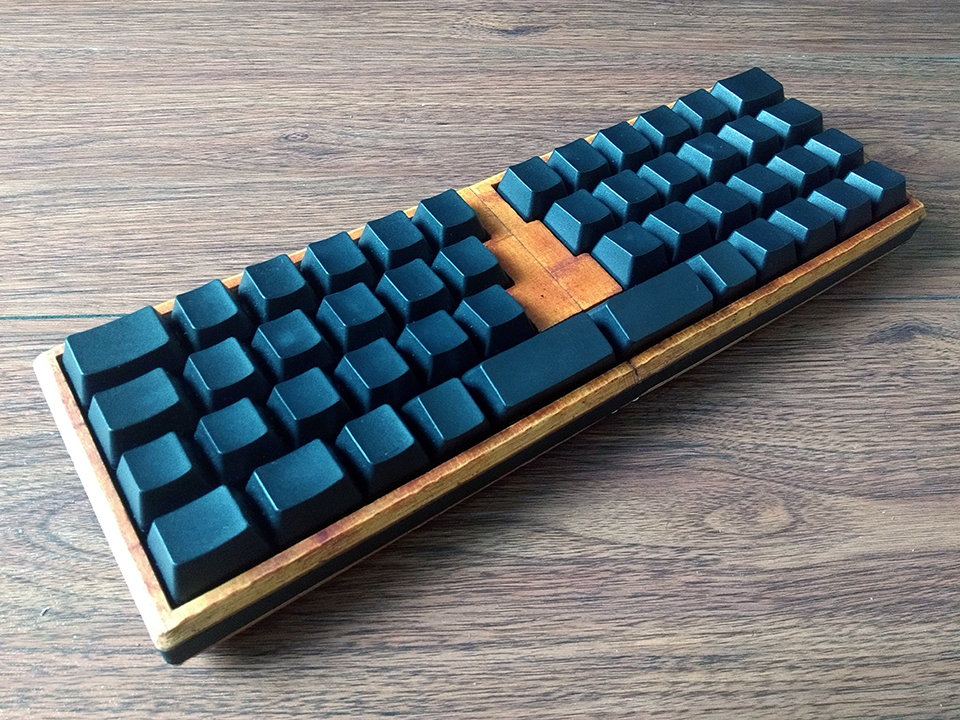
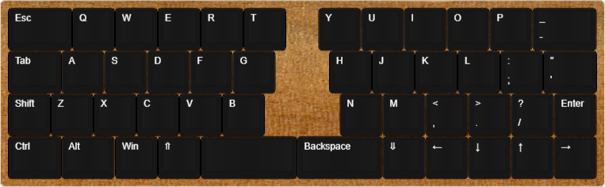

# Orson40

A 3D printable 40% reverse symmetrical layout keyboard

## Layout

[Keyboard Layout Editor](http://www.keyboard-layout-editor.com/#/gists/d5f8a9f842e0427862320fa1f12d8399)

## Components

### Required components

- 47× switches of your choice
- 2× plate-mounted Costar stabilizers
- 47× diodes
- Wires
- 10× M3×12 countersunk screws

## Build notes

Use super glue to fix halves together. The accent pieces are made to extend 5mm so you can cut/file it down to the perfect length. Glue the accent pieces to the top half instead of the bottom half.

## More info

More info can be found in [this blog post](https://ramonimbao.github.io/orson40/).

## License

This project is licensed under the MIT license. See the `LICENSE.md` for more details.